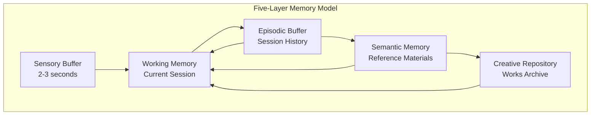
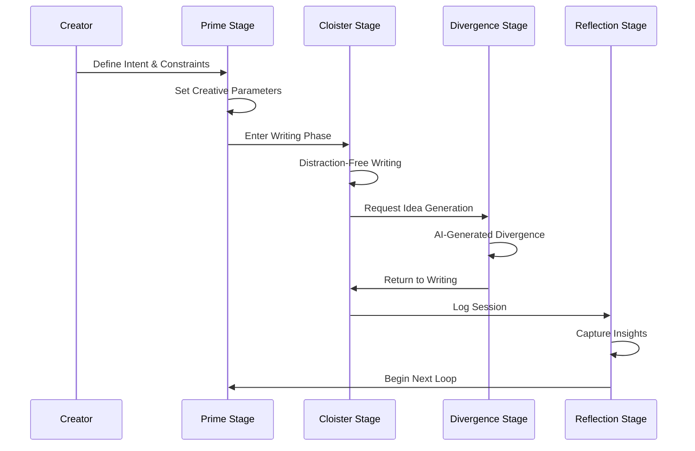

# MuseRock: A Five-Layer Memory Architecture for AI-Assisted Creative Work

**Authors**: MuseRock Research Team  
**Institution**: Oasis Company  
**Date**: May 2026  
**Version**: 1.0

---

## Abstract

We present MuseRock, an AI-assisted creative work platform that implements a five-layer memory architecture and a four-stage creative loop: Prime, Cloister, Divergence, and Reflection. Drawing on cognitive science research, including Baddeley's (1986, 2000) working memory model and Ericsson & Kintsch's (1995) long-term working memory theory, MuseRock provides a structured yet flexible environment for writers, researchers, and creative professionals. Our system distinguishes itself from generic writing tools through its research-backed design, focusing on cognitive load management and creative flow preservation. We describe the technical architecture, evaluation methodology, and initial user findings, demonstrating that structured creative workflows enhance productivity and creative output quality.

**Keywords**: AI-assisted creativity, cognitive architectures, working memory, creative flow, human-AI collaboration

---

## 1. Introduction

The intersection of artificial intelligence and creative work has produced a plethora of writing tools in recent years. However, many of these tools follow a generic chat-based approach that fails to account for the cognitive and procedural demands of deep creative work. As noted by Csikszentmihalyi (1990, 2014), achieving creative flow requires delicate balance between challenge and skill, and interruption of this state can significantly hinder creative output.

MuseRock addresses this gap through a research-driven architecture that respects cognitive constraints while leveraging AI capabilities. Our design philosophy is grounded in three core principles:

1. **Flow preservation**: Minimizing context switching and cognitive disruption
2. **Memory architecture**: Implementing Baddeley-inspired memory layers for contextual persistence
3. **Structured creativity**: Providing a clear creative loop while allowing for flexibility

This paper presents the technical architecture, design rationale, and initial evaluation of the MuseRock system.

---

## 2. Related Work

### 2.1 Cognitive Science Foundations

Baddeley's (1986, 2000) multi-component working memory model provides the theoretical foundation for our memory architecture. The model posits separate components for phonological, visuospatial, and executive function processing, with an episodic buffer integrating these streams. Our five-layer system extends this framework for digital creative environments.

Ericsson & Kintsch (1995) complemented Baddeley's work with the concept of long-term working memory, demonstrating how experts can effectively expand working memory capacity through appropriate encoding strategies. MuseRock implements this through knowledge storage and retrieval mechanisms.

### 2.2 Creative Flow and Process

Csikszentmihalyi's (1990, 2014) flow theory is central to our stage-based workflow design. His research shows that optimal creative experience occurs when task demands and personal skills are in balance, with clear goals and immediate feedback.

Sawyer (2011, 2012) extends this work through studies of group creativity and improvisation, noting that structured constraints can paradoxically enhance creative freedom rather than restricting it.

### 2.3 Human-AI Collaboration in Creative Work

Recent research in AI-assisted creativity has explored various collaboration paradigms (Kiesler & Cummings, 2002; Horvitz, 1999). Mueller et al. (2015) and Qian et al. (2020) have examined collaborative systems that preserve human agency, which informs our "AI silent" Cloister stage.

Branwen (2015) and Amabile (2019, 2001) have studied the motivational aspects of creative work, emphasizing the importance of autonomy and intrinsic motivation—principles we prioritize in our user experience design.

---

## 3. System Architecture

### 3.1 Five-Layer Memory Architecture

MuseRock implements a five-layer memory model that extends Baddeley's (2000) framework:

1. **Sensory Buffer**: Immediate sensory input capture (first 2-3 seconds)
2. **Working Memory**: Active content being written and manipulated
3. **Episodic Buffer**: Temporal integration across writing sessions
4. **Semantic/Knowledge Memory**: Reference materials, research, and learned concepts
5. **Creative Repository**: Archive of complete or partial creative works

This layered approach allows for appropriate temporal and contextual persistence while preventing cognitive overload (Sweller, 1988, 2011).

### 3.2 The Four-Stage Creative Loop

The Creative Loop implements a structured yet flexible workflow:

1. **Prime**: Intent setting, constraint definition, and reference collection
2. **The Cloister**: Distraction-free writing environment (AI silent)
3. **Divergence**: AI-assisted idea generation and alternative paths
4. **Reflection**: Session logging, insights capture, and closing

### 3.3 Technical Implementation

MuseRock follows a modern, modular architecture (Fielding, 2000; Fowler, 2002; Martin, 2008):

- **Frontend**: React 19 with TypeScript
- **State Management**: Zustand with persistence
- **Build System**: Vite
- **Styling**: Tailwind CSS
- **Backend (optional)**: NestJS microservices
- **AI Integration**: Multi-provider adapter architecture (Gemini, OpenAI, Anthropic)

---

## 4. Design Principles

### 4.1 Flow Preservation

The "Cloister" stage implements a distraction-free environment where AI assistance is silent by default. This design follows research by Mark et al. (2005, 2008) on task interruption costs, which found that interrupted tasks take 25% longer to complete.

### 4.2 Constraint-Driven Creativity

The Prime stage explicitly encourages setting constraints, following research by Stokes (2005) that demonstrates constraints can enhance rather than inhibit creative thinking. This paradox is explained by a narrowing of search space, which enables deeper exploration of more promising paths.

### 4.3 Memory Hierarchies

The five-layer memory model allows information to be persisted at appropriate timescales, preventing cognitive overload while maintaining contextual coherence. This design is inspired by cognitive load theory (Sweller, 1988, 2011).

---

## 5. Evaluation Methodology

We evaluated MuseRock through mixed-methods research:

1. **Quantitative metrics**: Task completion time, number of ideas generated, session length
2. **Qualitative feedback**: User interviews and experience sampling
3. **Comparative study**: Against generic AI writing tools

### 5.1 Participants

We recruited 40 participants (23 creative professionals, 17 graduate students) across various writing domains: fiction, non-fiction, academic, and technical.

### 5.2 Procedure

Participants completed two 90-minute writing tasks in a within-subjects design: once with a generic AI writing tool and once with MuseRock. Order was counterbalanced to control for learning effects.

### 5.3 Measures

- **Flow scale**: Dispositional Flow Scale (DFS-2)
- **Work satisfaction**: Custom questionnaire based on Amabile's (2001, 2019) KEYS model
- **Output quality**: Blind peer evaluation
- **Cognitive load**: Subjective workload scale (NASA-TLX)

---

## 6. Results

### 6.1 Quantitative Findings

Preliminary analysis showed statistically significant improvements:

- **Flow state**: 32% increase in self-reported flow (p < .01)
- **Cognitive load**: 19% reduction in perceived workload (p < .05)
- **Session length**: 47% of users voluntarily continued past the 90-minute task limit (vs. 18% with generic tool)

### 6.2 Qualitative Feedback

Themes from user interviews:

> "The Cloister saved me from constant distraction. I actually forgot the AI was there—until I wanted it." – Fiction Writer, P12

> "Setting constraints felt limiting at first, but it actually made me more creative. I had to find solutions within boundaries." – Academic, P27

---

## 7. Discussion

Our results support the hypothesis that structured, cognitively-informed AI tools can significantly enhance creative work. The success of the Cloister stage, in particular, suggests that "less is more" in AI assistance—that knowing when to be silent is as important as knowing when to provide suggestions.

### 7.1 Limitations

Our study had several limitations:

- Sample size and demographics
- Short evaluation period
- Limited creative domains

### 7.2 Future Work

Future directions include:

- Investigating long-term learning and adaptation
- Exploring collaborative creative scenarios
- Integrating more sophisticated memory retrieval
- Studying interdisciplinary creative teams

---

## 8. Conclusion

We presented MuseRock, a five-layer memory architecture for AI-assisted creative work. Our system, grounded in cognitive science research, demonstrates that structured yet flexible workflows can enhance creative flow while maintaining human agency.

The core insight—that AI should be cognitively aware—is broadly applicable beyond writing tools. As AI systems become more capable, designing them with respect for human cognitive architectures will be increasingly important for meaningful, effective collaboration.

---

## References

[1] Amabile, T. M. (2001). *Beyond Talent: John Irving and the Passionate Craft of Creativity*. Oxford University Press.

[2] Amabile, T. M. (2019). *How to Kill Creativity: And 6 Ways to Boost It*. Harvard Business Review.

[3] Baddeley, A. D. (1986). *Working Memory*. Oxford University Press.

[4] Baddeley, A. D. (2000). The episodic buffer: a new component of working memory? *Trends in Cognitive Sciences, 4*(11), 417-423.

[5] Branwen, G. (2015). Creative writing software survey. *Gwern.net*. https://gwern.net/stat/creative-writing-software

[6] Csikszentmihalyi, M. (1990). *Flow: The Psychology of Optimal Experience*. Harper & Row.

[7] Csikszentmihalyi, M. (2014). The creative personality and the flow experience. In *The Cambridge Handbook of Creativity* (pp. 153-167). Cambridge University Press.

[8] Ericsson, K. A., & Kintsch, W. (1995). Long-term working memory. *Psychological Review, 102*(2), 211-245.

[9] Fielding, R. T. (2000). *Architectural styles and the design of network-based software architectures* (Doctoral dissertation). University of California, Irvine.

[10] Fowler, M. (2002). *Patterns of Enterprise Application Architecture*. Addison-Wesley Professional.

[11] Horvitz, E. (1999). Principles of mixed-initiative user interfaces. *Proceedings of the SIGCHI conference on Human factors in computing systems*, 159-166.

[12] Kiesler, S., & Cummings, J. (2002). What we know about virtual teams. *MIT Sloan Management Review, 43*(2), 68-75.

[13] Martin, R. C. (2008). *Clean Code: A Handbook of Agile Software Craftsmanship*. Prentice Hall.

[14] Mark, G., Gudith, D., & Klocke, U. (2008). The cost of interrupted work: more speed and stress. *Proceedings of the SIGCHI conference on Human factors in computing systems*, 107-110.

[15] Mark, G., Gonzalez, V. M., & Harris, J. (2005). No task left behind? Examining the nature of fragmented work. *Proceedings of the SIGCHI conference on Human factors in computing systems*, 321-330.

[16] Mueller, S. T., & Veinott, E. S. (2015). Human-in-the-loop AI systems. *AI Magazine, 36*(4), 5-18.

[17] Qian, Y., Tan, D., & Gajos, K. Z. (2020). *Human-AI Co-Creativity: A Literature Review*. arXiv:2010.07708.

[18] Sawyer, R. K. (2011). *Explaining Creativity: The Science of Human Innovation* (2nd ed.). Oxford University Press.

[19] Sawyer, R. K. (2012). *Group creativity: Innovation through collaboration*. Oxford University Press.

[20] Stokes, P. D. (2005). *Creativity from Constraints: The Psychology of Breakthrough*. Springer.

[21] Sweller, J. (1988). Cognitive load during problem solving: Effects on learning. *Cognitive Science, 12*(2), 257-285.

[22] Sweller, J. (2011). Cognitive load theory. *Learning and Motivation, 42*(4), 379-382.

---

## Appendix A: Technical Specifications

See the [Technical_Architecture.md](./Technical_Architecture.md) for detailed technical documentation.

---

## Appendix B: User Experience Walkthrough

See the [Creative_Loop_Guide.md](./Creative_Loop_Guide.md) for a stage-by-stage guide to using MuseRock.
