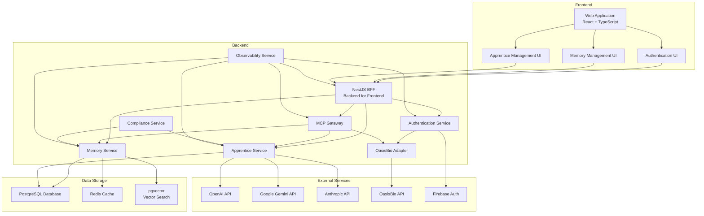

# MuseRock Technical Architecture

## System Overview

MuseRock is a modular, distributed system designed to provide creative assistance through AI-powered agents and advanced memory management. The system follows a microservices architecture with clear separation of concerns between frontend, backend, and external services.

## Architecture Diagram

## Component Details

### Frontend Layer

#### Web Application
- **Framework**: React 19 with TypeScript
- **Build Tool**: Vite
- **Styling**: Tailwind CSS
- **State Management**: Local Storage for client-side state
- **Key Components**:
  - Authentication UI: Handles user login and OAuth flow
  - Memory Management UI: Visualizes and manages memory items
  - Apprentice Management UI: Creates and manages AI agents

#### Authentication Flow
1. User clicks "Continue with Oasis" button
2. Frontend redirects to backend OAuth endpoint
3. Backend initiates OAuth flow with OasisBio
4. User authenticates with OasisBio
5. OasisBio redirects back to backend callback
6. Backend exchanges code for tokens and stores them in httpOnly cookies
7. Backend redirects back to frontend
8. Frontend checks authentication status via userinfo endpoint

### Backend Layer

#### NestJS BFF (Backend for Frontend)
- **Framework**: NestJS with TypeScript
- **Responsibilities**:
  - Routing and request handling
  - Authentication and session management
  - API aggregation and transformation
  - Error handling and logging

#### Authentication Service
- **Responsibilities**:
  - OAuth 2.0 + PKCE flow implementation
  - Token management and refresh
  - User session management
  - Integration with Firebase Auth

#### Memory Service
- **Responsibilities**:
  - 5-layer memory management
  - Memory storage and retrieval
  - Search and query processing
  - ACL and sensitivity filtering
  - Vector search integration

#### AI Service
- **Responsibilities**:
  - AI model integration and orchestration
  - Structured output generation with JSON schemas
  - Prompt template management and rendering
  - Multi-provider support via adapter pattern
  - Token usage tracking and reporting

#### Prompt Registry Service
- **Responsibilities**:
  - CRUD operations for prompt templates
  - Template versioning
  - Variable validation and substitution
  - JSON schema definitions for structured outputs
  - Default templates for all roles (researcher, writer, designer, musician)

#### Model Adapter Layer
- **Responsibilities**:
  - Unified interface for all AI providers
  - OpenAI API integration
  - Google Gemini API integration
  - Structured output support
  - Token usage tracking
  - Provider-specific configuration

#### Apprentice Service
- **Responsibilities**:
  - Agent lifecycle management
  - Job queue and processing
  - AI model integration
  - Task execution and result management
  - Budget and timeout control

#### MCP Gateway
- **Responsibilities**:
  - JSON-RPC protocol implementation
  - Method routing and execution
  - Request validation and rate limiting
  - Batch request processing
  - Error handling and reporting

#### OasisBio Adapter
- **Responsibilities**:
  - OasisBio API integration
  - User profile synchronization
  - Bio asset access and management
  - Personalized recommendation handling

#### Compliance Service
- **Responsibilities**:
  - Data privacy and security checks
  - OWASP Top 10 vulnerability scanning
  - Data sanitization and masking
  - Compliance reporting

#### Observability Service
- **Responsibilities**:
  - Log collection and analysis
  - Performance metrics collection
  - Distributed tracing
  - Health checks and monitoring
  - Alerting and incident response

### Data Storage Layer

#### PostgreSQL Database
- **Usage**:
  - Persistent storage for memory items
  - Apprentice and job data
  - User information
  - System configuration

#### Redis Cache
- **Usage**:
  - In-memory caching for frequently accessed data
  - Session storage
  - Rate limiting counters
  - Temporary state storage

#### pgvector
- **Usage**:
  - Vector embeddings for memory items
  - Semantic search capabilities
  - Similarity matching

### External Services

#### AI Model APIs
- **OpenAI API**: GPT models for text generation and analysis
- **Google Gemini API**: Multimodal AI capabilities
- **Anthropic API**: Claude models for conversational AI

#### Authentication Services
- **Firebase Auth**: Additional authentication provider
- **OasisBio API**: OAuth provider and bio asset access

## Data Flow

### Memory Operations
1. Frontend sends memory operation request to BFF
2. BFF validates request and routes to Memory Service
3. Memory Service processes request and stores/retrieves data
4. Memory Service applies ACL and sensitivity filtering
5. For search operations, Memory Service uses pgvector for semantic search
6. Results are returned through BFF to frontend

### Apprentice Job Execution
1. Frontend creates job request via BFF
2. BFF routes request to Apprentice Service
3. Apprentice Service adds job to queue
4. Job processor picks up job and executes it
5. Apprentice Service calls appropriate AI model API
6. Results are stored and returned to frontend

### MCP Requests
1. Client sends JSON-RPC request to MCP Gateway
2. MCP Gateway validates request and routes to appropriate service
3. Service executes requested method
4. Results are formatted as JSON-RPC response and returned to client

## Security Architecture

### Authentication and Authorization
- **OAuth 2.0 + PKCE**: Secure third-party authentication
- **httpOnly Cookies**: Token storage to prevent XSS attacks
- **Access Control**: Role-based access control for resources
- **Session Management**: Secure session handling and expiration

### Data Security
- **Encryption**: Transport-level encryption (HTTPS)
- **Data Sanitization**: Input validation and sanitization
- **Sensitivity Filtering**: Access control based on data sensitivity
- **Compliance Checks**: Regular security audits and vulnerability scans

### API Security
- **Rate Limiting**: Prevention of API abuse
- **Request Validation**: Input validation and schema checks
- **Error Handling**: Secure error reporting without sensitive information
- **CORS Configuration**: Restrict cross-origin requests

## Scalability Considerations

### Horizontal Scaling
- **Stateless Design**: Services are designed to be stateless for easy scaling
- **Load Balancing**: Distribution of requests across multiple instances
- **Auto-scaling**: Dynamic resource allocation based on load

### Performance Optimization
- **Caching**: Redis for frequently accessed data
- **Database Optimization**: Indexing and query optimization
- **Parallel Processing**: Concurrent execution of independent tasks
- **Batch Processing**: Efficient handling of multiple requests

### Resilience
- **Circuit Breakers**: Protection against cascading failures
- **Retry Mechanisms**: Automatic retry for transient failures
- **Graceful Degradation**: System continues to function with reduced capabilities
- **Disaster Recovery**: Backup and restoration procedures

## Deployment Architecture

### Containerization
- **Docker**: Containerization of services
- **Kubernetes**: Orchestration and management of containers

### CI/CD Pipeline
- **GitHub Actions**: Automated build, test, and deployment
- **Artifact Repository**: Storage of build artifacts
- **Deployment Strategy**: Blue-green or rolling deployments

### Environment Management
- **Development**: Local development environment
- **Staging**: Pre-production testing environment
- **Production**: Live production environment

## Monitoring and Observability

### Logging
- **Structured Logs**: JSON-formatted logs for easy analysis
- **Log Aggregation**: Centralized log collection and storage
- **Log Analysis**: Tools for log search and analysis

### Metrics
- **Performance Metrics**: Response times, throughput, error rates
- **Resource Metrics**: CPU, memory, disk usage
- **Business Metrics**: User activity, feature usage

### Tracing
- **Distributed Tracing**: End-to-end request tracking
- **Service Dependencies**: Visualization of service interactions
- **Performance Bottlenecks**: Identification of slow operations

### Alerting
- **Threshold-based Alerts**: Notifications for performance issues
- **Anomaly Detection**: Automatic detection of unusual patterns
- **Incident Response**: Automated response to critical issues

## Conclusion

The MuseRock technical architecture is designed to be scalable, secure, and reliable, with clear separation of concerns and modular components. By leveraging modern technologies and best practices, the system provides a robust foundation for delivering intelligent creative assistance to users.

---

*Document updated on: 2026-05-08*
*Version: 1.1*
*Author: MuseRock Team*